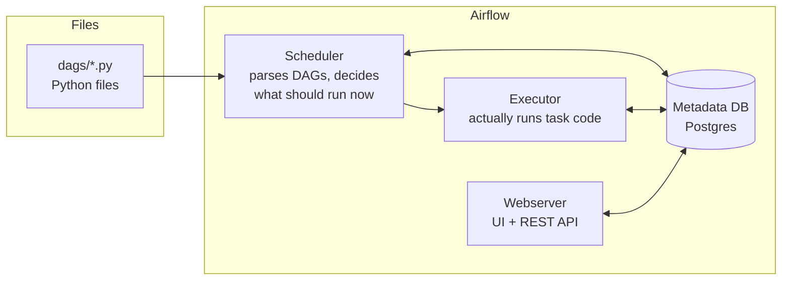
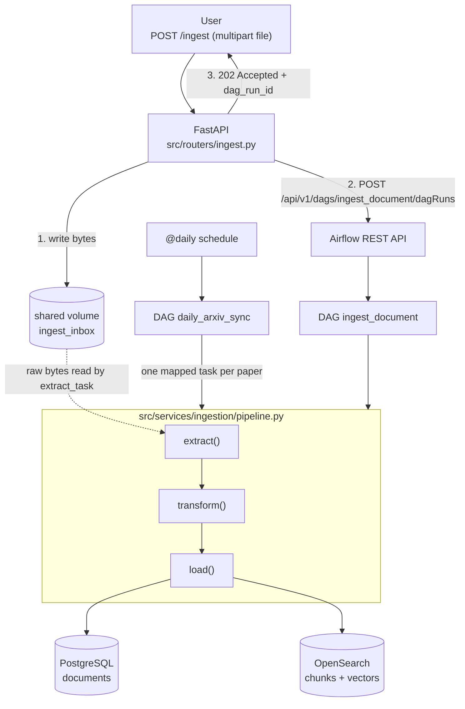
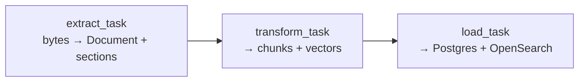
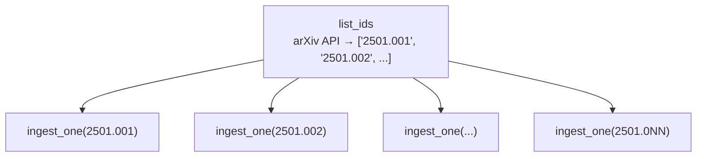

₹₹`# ETL Pipelines with Apache Airflow — Technical Guide

> **Scope:** everything needed to build, run, debug and reason about the ETL layer of this
> project. Part 1 is theory (what ETL is, why an orchestrator exists, what Airflow's parts
> are). Part 2 is practice — the actual code in this repository, line by line, plus the
> Docker image that runs it.
>
> **Audience:** a backend developer coming from Java/Spring who has not used Airflow or
> Docker before.

---

## Table of contents

1. [What ETL actually means](#1-what-etl-actually-means)
2. [Why an orchestrator instead of a cron job](#2-why-an-orchestrator-instead-of-a-cron-job)
3. [Airflow's mental model](#3-airflows-mental-model)
4. [Airflow vocabulary, one concept at a time](#4-airflow-vocabulary-one-concept-at-a-time)
5. [How Airflow maps to Java/Spring ideas](#5-how-airflow-maps-to-javaspring-ideas)
6. [This project's ETL — architecture](#6-this-projects-etl--architecture)
7. [The ETL core: `pipeline.py`](#7-the-etl-core-pipelinepy)
8. [DAG 1 — `ingest_document` (on-demand)](#8-dag-1--ingest_document-on-demand)
9. [DAG 2 — `daily_arxiv_sync` (scheduled + dynamic mapping)](#9-dag-2--daily_arxiv_sync-scheduled--dynamic-mapping)
10. [The FastAPI trigger boundary](#10-the-fastapi-trigger-boundary)
11. [Docker — the Airflow image, explained instruction by instruction](#11-docker--the-airflow-image-explained-instruction-by-instruction)
12. [Docker Compose — how the containers find each other](#12-docker-compose--how-the-containers-find-each-other)
13. [Idempotency, retries and exactly-once thinking](#13-idempotency-retries-and-exactly-once-thinking)
14. [Running it end to end](#14-running-it-end-to-end)
15. [Debugging guide](#15-debugging-guide)
16. [Testing the pipeline](#16-testing-the-pipeline)
17. [Production notes and what changes at scale](#17-production-notes-and-what-changes-at-scale)
18. [Glossary](#18-glossary)

---

## 1. What ETL actually means

**ETL = Extract, Transform, Load.** It is the oldest and still the most useful shape for
"move data from where it is into where you can query it."

| Stage | Question it answers | In this project |
|---|---|---|
| **Extract** | Where do the bytes come from, and what do they mean? | Read a PDF/Word/HTML/Markdown/arXiv file, parse it into a `Document` plus a list of `(heading, text)` sections |
| **Transform** | What shape does the destination need? | Split sections into ~512-token chunks, attach context, compute a 1024-dim embedding per chunk |
| **Load** | Write it, safely, repeatably | Insert document metadata into PostgreSQL, index chunks + vectors into OpenSearch |

### ETL vs ELT

- **ETL** transforms *before* loading. You control the shape that lands in the store. This
  is what a RAG system wants — chunking and embedding are expensive and you do not want to
  redo them on every query.
- **ELT** dumps raw data into a warehouse and transforms with SQL later (`dbt` style).
  Great for analytics, wrong for us: you cannot compute an embedding in SQL.

We do ETL. The transform (embedding) is the expensive, GPU/CPU-bound step, and it must
happen exactly once per chunk.

### Why the three stages are separate *functions* and separate *tasks*

If extract/transform/load were one function, a failure in the embedding model would force
a re-parse of a 90-page PDF. Splitting them means:

- **retry granularity** — retry only the failed stage;
- **observability** — the Airflow UI shows you *which* stage a document died in;
- **testability** — each stage is a pure-ish function you can unit-test with fixtures;
- **portability** — the same three functions back both the DAG and any other caller.

That last one is the key architectural rule in this repo: **`pipeline.py` imports nothing
from Airflow and nothing from FastAPI.** The orchestrator is a caller, not an owner.

---

## 2. Why an orchestrator instead of a cron job

You could write:

```bash
0 3 * * * /usr/bin/python /app/sync_arxiv.py >> /var/log/sync.log 2>&1
```

That works until it doesn't. Here is what cron does not give you:

| Need | cron | Airflow |
|---|---|---|
| Retry a failed step | write your own loop | `retries=2, retry_delay=...` |
| Retry only the *failed* step | impossible — whole script re-runs | task-level retries |
| Know *why* it failed | grep a log file | per-task log in the UI, one click |
| Run 200 papers in parallel, 2 at a time | write a semaphore | `.expand()` + `max_active_tis_per_dag=2` |
| Backfill last month | write a loop over dates | `airflow dags backfill` |
| Don't start B until A succeeded | put them in one script and hope | dependency graph is the primitive |
| Prevent two runs overlapping | flock file | `max_active_runs`, catchup control |
| Trigger from an API | write an HTTP server | Airflow's REST API |
| See history/duration trends | none | built-in |

The rule of thumb: **the moment a scheduled job has more than one step, or more than one
input, or needs to be re-runnable, you want an orchestrator.** Airflow is the industry
default (Airbnb-born, Apache-governed). Prefect and Dagster are lighter modern
alternatives; learning Airflow first makes it obvious *why* they exist.

---

## 3. Airflow's mental model

Airflow is three long-lived processes plus a database.



Read that diagram as a sentence:

> The **scheduler** re-parses your DAG files every few seconds, writes "this task should
> run" rows into the **metadata database**, and hands them to the **executor**, which runs
> the Python. The **webserver** never runs your code — it only reads the metadata database
> to draw the UI and serve the REST API.

Three consequences that trip up everyone:

1. **A DAG file is parsed constantly.** Top-level code in a DAG file runs on every parse —
   every ~30 seconds, forever. Never put a database query, an HTTP call, or a heavy import
   at the top level of a DAG file. (This is why our DAGs import `src.services...` *inside*
   the task functions, not at module level.)
2. **The webserver showing a green box does not mean the code ran there.** It ran in the
   executor's process/container. Logs come from there.
3. **State lives in Postgres, not in memory.** Restarting the scheduler loses nothing.

---

## 4. Airflow vocabulary, one concept at a time

### DAG

**D**irected **A**cyclic **G**raph. A workflow: nodes are tasks, edges are dependencies, no
cycles allowed (a cycle would mean "A waits for B waits for A" — deadlock).

In modern Airflow (2.x TaskFlow API), a DAG is a decorated function:

```python
@dag(dag_id="ingest_document", schedule=None, catchup=False, start_date=...)
def ingest_document():
    ...
ingest_document()   # <- the call at the bottom REGISTERS the DAG
```

That trailing call is easy to miss and is the #1 reason a DAG "doesn't appear in the UI."

### Task

One node. Created with `@task` in the TaskFlow API. Each task runs in its own process,
with its own log, its own retry counter.

### Operator

The classic (pre-TaskFlow) way of defining a task: `PythonOperator`, `BashOperator`,
`DockerOperator`, `PostgresOperator`, etc. `@task` is sugar that builds a `PythonOperator`
under the hood. Use `@task` for Python; reach for a specific operator when you want
Airflow to manage a connection for you.

### TaskInstance (TI)

One task, on one specific run. `ingest_document.transform_task` for run
`manual__2026-07-25T10:00:00`. Retries, logs, and duration are all per-TaskInstance.

### DAG Run

One execution of the whole DAG — triggered by the schedule, by the API, or by a human.
Carries a `run_id` and an optional `conf` dict (the parameters).

### Scheduler

Parses DAG files, evaluates schedules, creates DAG Runs and TaskInstances, enqueues them.

### Executor

*How* task code runs. The choice matters:

| Executor | Runs tasks | Use when |
|---|---|---|
| `SequentialExecutor` | one at a time, in-process | never, outside a first tutorial |
| **`LocalExecutor`** | subprocesses on the scheduler machine | single box, moderate load — **what we use** |
| `CeleryExecutor` | worker pool over Redis/RabbitMQ | horizontal scale-out |
| `KubernetesExecutor` | one pod per task | elastic, isolated, cloud-native |

We use `LocalExecutor` (`AIRFLOW__CORE__EXECUTOR: LocalExecutor` in compose). It gives real
parallelism without running a Celery broker and a worker fleet. Moving to Celery later is a
config change plus new containers — the DAG code does not change. That is the point of the
abstraction.

### XCom ("cross-communication")

How one task hands a value to the next. Return a value from a `@task` function and Airflow
serialises it into the metadata DB; the downstream task receives it as an argument.

**XCom is a message channel backed by a database table, not a data pipe.** Rows are stored
in Postgres. Passing a 200 MB PDF through XCom would bloat the metadata DB and slow the
scheduler.

This is exactly why `POST /ingest` writes the raw bytes to a shared Docker volume and only
the **key** (filename) travels through the DAG's `conf`. The file never enters XCom.

> Note the honest `ponytail:` comment at the top of `ingest_document.py`: chunk payloads
> *with* their 1024-dim embeddings currently do ride XCom between `transform` and `load`.
> That is fine at learning scale and is documented as a known ceiling — the upgrade path is
> to write chunks to the filesystem or a staging table and pass a pointer.

### Retries and `retry_delay`

```python
default_args={"retries": 2, "retry_delay": pendulum.duration(minutes=1)}
```

Applied to every task in the DAG. A task that raises is retried after the delay. This is
only safe if the task is **idempotent** — see §13.

### Trigger rules

By default a task runs when **all** upstream tasks succeeded (`all_success`). Others:
`all_done` (run regardless — good for cleanup), `one_failed` (alerting branch),
`none_failed_min_one_success`. We use the default everywhere; you reach for the others when
you build cleanup or notification branches.

### Catchup

`catchup=False` means: if the scheduler starts today and `start_date` was 2024-01-01, do
**not** run 500 historical daily runs. Both our DAGs set it. Set `catchup=True` only when
each historical run is meaningful (e.g. a daily partition build) and idempotent.

### `schedule`

- `"@daily"` — once a day (cron under the hood: `0 0 * * *`).
- `None` — never on a timer; only triggered externally. `ingest_document` uses this.
- Any cron string, or a `timedelta`, or a dataset/asset condition.

### Connections, Variables, Pools

- **Connection** — named, stored credentials (host/user/password) so DAG code never
  hardcodes secrets. We currently pass config through environment variables instead, which
  is simpler and equally valid for a single-tenant deployment.
- **Variable** — a key/value config store readable from DAG code.
- **Pool** — a global concurrency budget. "At most 4 tasks may talk to the embedding model
  at once," across all DAGs. We approximate this with `max_active_tis_per_dag=2` in the
  arXiv DAG.

### Parallelism knobs, from widest to narrowest

| Setting | Scope |
|---|---|
| `AIRFLOW__CORE__PARALLELISM` | total running tasks in the whole deployment |
| `max_active_runs` (per DAG) | concurrent DAG Runs of one DAG |
| `AIRFLOW__CORE__MAX_ACTIVE_TASKS_PER_DAG` | concurrent tasks within one DAG |
| `max_active_tis_per_dag` (per task) | concurrent instances of *one task* — our arXiv politeness cap |
| Pool slots | shared budget across DAGs |

---

## 5. How Airflow maps to Java/Spring ideas

| Airflow | Java / Spring analogue | Difference that matters |
|---|---|---|
| DAG | A Spring Batch `Job` | The graph is data; you can generate it at runtime |
| Task | A Spring Batch `Step` | Each runs in its own OS process |
| Scheduler | `@Scheduled` / Quartz | Persists state, so restarts are safe |
| Executor | `TaskExecutor` / thread pool | Swappable to a cluster without code change |
| XCom | `JobExecutionContext` / `ExecutionContext` | Backed by a DB table; keep payloads small |
| Retries | `@Retryable` (Spring Retry) | Configured declaratively per task |
| Connections | `application.yml` datasource + Vault | Managed in the UI, encrypted at rest |
| DAG Run `conf` | Job parameters | Arbitrary JSON |
| `@dag` / `@task` decorators | Annotations (`@Bean`, `@Step`) | Decorators are just functions returning functions — see below |

### Python syntax you will meet in these files

**Decorators.** `@dag(...)` above a function means `ingest_document = dag(...)(ingest_document)`.
A decorator is a function that takes a function and returns a replacement. Java's closest
equivalent is an annotation *plus* the framework code that reacts to it — in Python the
annotation and the reaction are the same object.

**`from __future__ import annotations`.** Makes all type hints lazy strings. Lets you write
`list[str]` and `str | None` on older runtimes and avoids importing types just to annotate.

**`async` / `await` and `asyncio.run(...)`.** Our parsing/embedding functions are `async`
(they do network and file I/O). Airflow tasks are synchronous, so each task calls
`asyncio.run(...)` to start an event loop, run the coroutine to completion, and shut the
loop down. Java parallel: `CompletableFuture.get()` at the edge of an async world.

**Type hints.** `-> tuple[str, int]` is documentation the type-checker enforces; Python
does not enforce it at runtime.

**Pydantic models** (`Document`, `Chunk`). DTOs with validation. `model_dump(mode="json")`
serialises to plain JSON-safe dicts — necessary because XCom must serialise.

**Inner functions.** The `@task` functions are defined *inside* the `@dag` function. They
close over the DAG's scope. Java has no direct equivalent beyond anonymous inner classes.

---

## 6. This project's ETL — architecture

Two entry points, one pipeline.



**Every arrow, explained:**

1. The client uploads a file over HTTP. FastAPI reads it into memory.
2. FastAPI writes it to `INBOX_DIR` under a UUID-prefixed key. This directory is a Docker
   **named volume** mounted into *both* the app container (`/inbox`) and every Airflow
   container (`/opt/airflow/inbox`) — that shared mount is how bytes cross the container
   boundary without going over the network or through XCom.
3. FastAPI calls Airflow's REST API with `conf = {key, filename, source_type}`.
4. FastAPI returns `202 Accepted` immediately. It never waits for parsing or embedding.
5. Airflow's scheduler sees a new DAG Run and starts `extract_task`, which reads the bytes
   back off the shared volume.
6. `transform_task` chunks and embeds. `load_task` writes to Postgres and OpenSearch.

The scheduled path skips steps 1–4 entirely: the schedule creates the run, `list_ids` calls
arXiv, and one mapped `ingest_one` task per paper runs the full pipeline in-process.

### The architectural rule

> **The FastAPI process never runs the ETL.** `pipeline.py` is imported only by Airflow
> tasks. FastAPI is a thin trigger; Airflow is the only execution engine.

Why this matters:

- A 90-page PDF parse plus 400 embeddings takes minutes. An HTTP request must not.
- The embedding model (`BAAI/bge-m3`, ~2 GB) would otherwise have to be resident in the web
  process, inflating memory and slowing cold starts.
- Retries, backfills and per-stage visibility come free once Airflow owns execution.
- The API can scale on request volume; the workers scale on ingestion volume. Different
  axes, different containers.

---

## 7. The ETL core: `pipeline.py`

File: `src/services/ingestion/pipeline.py`. This is the whole ETL, and it has zero
orchestrator imports.

### The source registry — Open/Closed in practice

```python
SOURCE_REGISTRY: dict[SourceType, DocumentSource] = {
    SourceType.MARKDOWN: MarkdownSource(),
    SourceType.PDF: PDFSource(),
    SourceType.WORD: WordSource(),
    SourceType.HTML: HTMLSource(),
    SourceType.TEXT: TextSource(),
    SourceType.ARXIV: ArxivSource(),
}
```

`DocumentSource` (in `src/services/interfaces/document_source.py`) is the interface — a
Python `Protocol`/ABC, Java's `interface`. Every concrete source implements
`parse(raw, filename) -> (Document, sections)`.

Adding a new file type = write one class + add one line here. **No router, no DAG, and no
pipeline function changes.** That is the Open/Closed Principle with a dictionary instead of
a Spring `@Component` scan.

`SourceType` is a Python `Enum` used as the dictionary key — the compiler equivalent of a
Java `EnumMap`.

### `extract`

```python
async def extract(raw, filename, source_type) -> tuple[Document, list[tuple[str | None, str]]]:
    source = SOURCE_REGISTRY.get(source_type)
    if source is None:
        raise ValueError(f"no DocumentSource registered for {source_type}")
    return await source.parse(raw, filename)
```

- **Input:** raw bytes, original filename, declared source type.
- **Output:** a `Document` (metadata: id, title, author, uri, published date) and a list of
  `(heading, body)` sections. The heading is `None` for formats without structure.
- **Failure modes:** unknown source type (`ValueError`, not retryable — retrying will fail
  identically); corrupt PDF (parser raises, retry may or may not help); OOM on a huge file.
- **Why `async`:** `ArxivSource` fetches over HTTP; keeping the interface uniform means the
  registry has one signature.

### `transform`

```python
async def transform(document, sections, source_type) -> list[Chunk]:
    chunks = chunk_document(document, sections, source_type)
    return await embed_chunks(chunks)
```

Two sub-steps, both worth understanding.

**Chunking** (`src/services/ingestion/chunker.py`) dispatches on source type via
`CHUNK_STRATEGY`:

- `structure_aware` for anything with headings (md/html/word/pdf/arxiv): walk sections,
  split each into atomic units (paragraphs; a run of `|...|` markdown table lines is *one*
  unit so a table never splits), then greedily pack units into windows of
  `TARGET_TOKENS = 512`. Oversized units fall back to sentence packing, then to overlapping
  token windows with `OVERLAP_TOKENS = 64`.
- `recursive_window` for plain text with no headings.

Each `Chunk` carries **two** texts:

| Field | Purpose |
|---|---|
| `text` | clean body — what a citation quotes, what a user sees |
| `embed_text` | `"Doc Title > Section Heading\n\nbody"` — what the vector is computed from |

That second field is **contextual retrieval**: a chunk from the middle of a paper reads as
"…we improve on the baseline by 3 points…" with no clue what the baseline is. Prefixing the
document title and section heading before embedding makes the vector encode *where* the
text lives, measurably improving recall. The citation still shows the clean body.

Token counting uses `tiktoken` with the `cl100k_base` encoding — counting characters would
mis-budget badly, since tokens ≈ 4 chars for English but ≈ 1 char for code or CJK.

**Embedding** (`src/services/embeddings/`) turns each `embed_text` into a 1024-dimensional
vector using `BAAI/bge-m3`, batched at `embedding_batch_size = 32`. Batching matters: one
forward pass over 32 texts is far cheaper than 32 passes.

### `load` — the only synchronous stage, and the interesting one

```python
def load(document: Document, chunks: list[Chunk]) -> tuple[str, int]:
    document_id, is_new = save_document(_engine, document)
    if not is_new:
        return document_id, 0   # already ingested — chunks already in OpenSearch
    indexed = index_chunks(document, chunks)
    return document_id, indexed
```

Two stores, deliberately:

| Store | Holds | Why |
|---|---|---|
| PostgreSQL | document metadata (title, uri, author, dates) | relational source of truth, unique constraints, joins |
| OpenSearch | chunks + BM25 text + 1024-d vectors | hybrid search — BM25 and kNN in one query |

`save_document` (`src/services/storage/repository.py`) uses SQLAlchemy **Core** (raw SQL,
DAO-style) rather than the ORM — Hibernate vs plain JDBC. For a three-column insert the ORM
buys nothing.

The dedup mechanic is the part worth memorising:

```sql
INSERT INTO documents (...) VALUES (...)
ON CONFLICT (source_uri) WHERE source_type = 'arxiv' DO NOTHING
RETURNING id
```

- The `WHERE` makes it a **partial unique index** (migration `002_arxiv_dedup.sql`): only
  arXiv rows are deduped by URI. You *can* upload the same PDF twice on purpose; you should
  never re-ingest the same arXiv paper.
- `RETURNING id` gives back the id **only if the row was actually inserted**. `None` means
  a conflict happened, so we look up the existing id and return `is_new = False`.
- The caller then skips OpenSearch indexing entirely — the chunks are already there.

This single query is what makes the whole daily sync safely re-runnable. **Idempotency is
enforced at the database, not in application logic** — because the database is the only
place that can enforce it atomically under concurrency.

### `run_ingest` — the convenience wrapper

```python
async def run_ingest(raw, filename, source_type) -> tuple[str, int]:
    document, sections = await extract(raw, filename, source_type)
    chunks = await transform(document, sections, source_type)
    return load(document, chunks)
```

Used by the arXiv DAG, where per-stage retry granularity is less valuable than keeping one
mapped task per paper.

---

## 8. DAG 1 — `ingest_document` (on-demand)

File: `infrastructure/airflow/dags/ingest_document.py`.



### The DAG declaration

```python
@dag(
    dag_id="ingest_document",
    schedule=None,
    catchup=False,
    start_date=pendulum.datetime(2024, 1, 1, tz="UTC"),
    tags=["ingestion"],
    default_args={"retries": 2, "retry_delay": pendulum.duration(seconds=30)},
)
```

| Argument | Why this value |
|---|---|
| `dag_id` | The name FastAPI posts to — must match `trigger_dag("ingest_document", ...)` |
| `schedule=None` | Never runs on a timer; external trigger only |
| `catchup=False` | No historical backfill (meaningless for an event-driven DAG) |
| `start_date` | Required by Airflow even when there is no schedule; a fixed past date is the idiom. **Never use `datetime.now()`** — it changes on every parse and the DAG's schedule becomes non-deterministic |
| `tags` | UI filtering |
| `retries=2, retry_delay=30s` | Transient failures (OpenSearch not ready, model still loading) resolve themselves |

`pendulum` is a timezone-aware datetime library; Airflow standardises on it because naive
datetimes cause real scheduling bugs.

### `extract_task`

```python
@task
def extract_task() -> dict:
    from src.schemas.document import SourceType
    from src.services.ingestion.pipeline import extract

    conf = get_current_context()["dag_run"].conf
    raw = (INBOX / conf["key"]).read_bytes()
    document, sections = asyncio.run(extract(raw, conf["filename"], SourceType(conf["source_type"])))
    return {
        "document": document.model_dump(mode="json"),
        "sections": sections,
        "source_type": conf["source_type"],
    }
```

Four things deserve attention:

1. **The imports are inside the function.** Top-level imports run on every DAG parse (every
   ~30 s). Importing the ingestion package pulls in `docling`, `tiktoken`,
   `sentence-transformers` — hundreds of megabytes and seconds of import time. Inside the
   task, they load once, in the worker process, only when the task actually runs. This is
   the single most important Airflow performance habit.
2. **`get_current_context()`** is how a TaskFlow task reaches runtime metadata — the DAG
   run, its `conf`, the logical date. Think of it as Spring's `RequestContextHolder`: an
   ambient, thread-local-ish accessor.
3. **The file is read from the shared volume, not from XCom.** Only the key travelled.
4. **`model_dump(mode="json")`** converts the Pydantic model to a JSON-safe dict, because
   the return value is serialised into the XCom table. A raw `Document` object would not
   serialise.

### `transform_task`

```python
document = Document(**payload["document"])
sections = [tuple(s) for s in payload["sections"]]
chunks = asyncio.run(transform(document, sections, SourceType(payload["source_type"])))
```

`Document(**payload["document"])` is dictionary unpacking — each key becomes a keyword
argument, and Pydantic validates every field. Java's closest equivalent is Jackson
deserialising into a DTO with Bean Validation.

`[tuple(s) for s in ...]` is a list comprehension fixing a JSON round-trip detail: JSON has
no tuple type, so Python's tuples came back as lists. The downstream code expects tuples.
Small, real, and exactly the kind of bug that only appears once you serialise between tasks.

### `load_task`

Rebuilds the `Document` and `Chunk` models from the dicts and calls `load`. Returns
`{"document_id": ..., "chunks_indexed": ...}` — visible in the UI's XCom tab, which is a
nice cheap way to see the outcome of a run without reading logs.

### Wiring

```python
load_task(transform_task(extract_task()))
```

This is the TaskFlow API's best trick: **you write it as function composition and Airflow
builds the dependency graph from it.** No `>>` operators, no `set_upstream`. Calling
`extract_task()` does not run the task — it returns an `XComArg`, a placeholder for "the
future output of this task." Passing it to `transform_task` declares the edge.

---

## 9. DAG 2 — `daily_arxiv_sync` (scheduled + dynamic mapping)

File: `infrastructure/airflow/dags/daily_arxiv_sync.py`.



### The key line

```python
ingest_one.expand(arxiv_id=list_ids())
```

`.expand()` is **dynamic task mapping** (Airflow 2.3+). You do not know at parse time how
many papers arXiv published yesterday. `expand` says: *take the list this upstream task
returns, and create one TaskInstance per element at runtime.*

Why this beats a `for` loop inside a single task:

- one failed paper does not fail the other 49;
- each paper retries independently;
- the UI shows 50 boxes, and you can see exactly which two are red;
- concurrency is controlled by Airflow, not by your own thread pool.

Java parallel: `list.parallelStream().forEach(...)` — except each element gets its own
process, its own retry policy, and its own log.

### Politeness and backpressure

```python
@task(max_active_tis_per_dag=2)
def ingest_one(arxiv_id: str) -> str:
```

At most two `ingest_one` instances run at once, across every run of this DAG. Two reasons:

1. **Be a good citizen.** arXiv is a free public service. Fifty concurrent PDF downloads is
   abusive and will get you rate-limited or blocked.
2. **Protect ourselves.** Each task loads the embedding model and holds a PDF in memory.
   Fifty at once would exhaust RAM on a laptop.

This is *backpressure expressed as configuration* — the kind of thing you would hand-roll
with a `Semaphore` in Java.

### The task bodies

```python
@task
def list_ids() -> list[str]:
    from src.services.ingestion.sources.arxiv_source import list_new_arxiv_ids
    since = pendulum.now("UTC").subtract(days=1).date()
    return asyncio.run(list_new_arxiv_ids(CATEGORY, since))
```

Returns a plain list of id strings — small, XCom-safe.

> **Improvement worth making:** this uses wall-clock `now()`. The Airflow-idiomatic version
> uses the run's **logical date** (`get_current_context()["data_interval_start"]`), so a
> backfill of last Tuesday fetches *last Tuesday's* papers rather than yesterday's. With
> `catchup=False` and a daily schedule the current behaviour is correct in practice, but
> the logical-date version is what makes a DAG genuinely re-runnable in time.

```python
@task(max_active_tis_per_dag=2)
def ingest_one(arxiv_id: str) -> str:
    async def _go() -> tuple[str, int]:
        pdf = await fetch_arxiv_pdf(arxiv_id)
        return await run_ingest(pdf, arxiv_id, SourceType.ARXIV)
    document_id, _ = asyncio.run(_go())
    return document_id
```

The nested `async def _go()` exists so that **two** awaits share a single event loop —
`asyncio.run` is called once, not twice. Calling it per-await would spin up and tear down a
loop each time, which is wasteful and breaks any shared async client state.

Note this DAG calls `run_ingest` (all three stages in one task) rather than three separate
tasks. Trade-off: less retry granularity per paper, but the mapped-task structure already
gives per-paper isolation, and 50 papers × 3 tasks = 150 boxes is harder to read than 50.

---

## 10. The FastAPI trigger boundary

File: `src/routers/ingest.py`.

```python
@router.post("/ingest")
async def ingest(file: UploadFile, source_type: SourceType = Form(...)):
    raw = await file.read()
    filename = file.filename or "unknown"

    key = f"{uuid.uuid4()}-{filename}"
    inbox = Path(settings.inbox_dir)
    inbox.mkdir(parents=True, exist_ok=True)
    (inbox / key).write_bytes(raw)

    run_id = await trigger_dag("ingest_document",
                               {"key": key, "filename": filename, "source_type": source_type.value})
    return JSONResponse(status_code=202, content={"status": "accepted", "dag_run_id": run_id})
```

| Line | Why |
|---|---|
| `UploadFile` | FastAPI streams to a spooled temp file rather than loading everything in RAM |
| `source_type: SourceType = Form(...)` | A multipart form field, validated against the enum. An invalid value returns 422 automatically — no manual validation |
| `uuid.uuid4()` prefix on the key | Two users uploading `paper.pdf` simultaneously must not collide |
| `mkdir(parents=True, exist_ok=True)` | Idempotent directory creation; no race between concurrent requests |
| `202 Accepted` | The correct status for "received, will process asynchronously." Not `200` (nothing is done yet), not `201` (nothing is created yet) |
| returning `dag_run_id` | The client's handle for polling status later |

And the trigger itself, `src/services/ingestion/airflow_client.py`:

```python
async def trigger_dag(dag_id: str, conf: dict, *, timeout: float = 15.0) -> str:
    url = f"{settings.airflow_base_url}/api/v1/dags/{dag_id}/dagRuns"
    async with httpx.AsyncClient(timeout=timeout) as client:
        resp = await client.post(url, json={"conf": conf},
                                 auth=(settings.airflow_user, settings.airflow_password))
        resp.raise_for_status()
        return resp.json()["dag_run_id"]
```

- `async with` is a **context manager** — Java's try-with-resources. It guarantees the HTTP
  connection pool is closed even if the request raises.
- `*` in the signature makes `timeout` keyword-only: callers must write `timeout=30`, never
  a mystery positional `30`.
- `raise_for_status()` converts a 4xx/5xx into an exception, so a broken trigger surfaces as
  a 500 rather than silently returning `None`.
- Basic auth comes from settings (`AIRFLOW__API__AUTH_BACKENDS: ...basic_auth` in compose
  enables it server-side).

**Security note:** the Airflow credentials currently default to `airflow`/`airflow` and the
OpenSearch security plugin is disabled. Both are marked as local-development-only in the
compose file. Before this leaves a laptop: real credentials from a secret store, the
OpenSearch security plugin re-enabled, and the Airflow webserver not exposed publicly.

### curl example

```bash
curl -X POST http://localhost:8000/ingest \
  -F "file=@./paper.pdf" \
  -F "source_type=pdf"
# {"status":"accepted","dag_run_id":"manual__2026-07-25T10:14:22+00:00"}
```

Then watch it: <http://localhost:8080> → DAGs → `ingest_document` → your run.

---

## 11. Docker — the Airflow image, explained instruction by instruction

File: `infrastructure/airflow/Dockerfile`.

### First, the Docker concepts

| Instruction | What it does |
|---|---|
| `FROM` | The base image you build on. Every image starts from another image |
| `WORKDIR` | Sets the current directory for later instructions (and at runtime) |
| `COPY` | Copies files from the **build context** (the directory you point `docker build` at) into the image |
| `RUN` | Executes a command **at build time**, and the result becomes a new layer |
| `ENV` | Sets an environment variable, baked into the image |
| `EXPOSE` | Documentation only — declares a port. Does not publish it |
| `CMD` | Default command at **run time**, overridable by the compose `command:` |
| `ENTRYPOINT` | The fixed executable at run time; `CMD` becomes its arguments |

**Layers and caching.** Each instruction creates a layer. Docker re-uses cached layers as
long as nothing above them changed. This is why dependency files are copied and installed
*before* application code: change your code and only the last layer rebuilds; change
`uv.lock` and dependencies reinstall. Our Airflow image takes this to its logical end — it
copies **only** `pyproject.toml` and `uv.lock`, never `src/`, because `src/` is mounted at
runtime as a volume. Editing a service file requires no rebuild at all.

### Now the file

```dockerfile
FROM apache/airflow:2.10.4-python3.12
```

Pinned exactly. Not `:latest` — a base image that silently changes underneath you is how
"it worked yesterday" happens. Airflow's official image already contains the scheduler,
webserver, CLI and a non-root `airflow` user.

```dockerfile
COPY --chmod=644 pyproject.toml uv.lock ./
```

- `./` is `/opt/airflow`, the base image's `WORKDIR`, owned by the `airflow` user.
- `--chmod=644` exists because of a real bug: `pyproject.toml` is `rwx------` on the host,
  `COPY` preserves the mode, and the non-root `airflow` user inside the container then
  cannot read the file it needs. Forcing 644 fixes it. (Documented in the file's own
  comments — good practice: a comment explaining a non-obvious flag saves the next person
  an hour.)

```dockerfile
RUN pip install --no-cache-dir uv \
 && uv export --frozen --no-dev --no-hashes -o requirements.txt \
 && grep -viE '^(fastapi|uvicorn|python-multipart)' requirements.txt > dag-requirements.txt \
 && pip install --no-cache-dir -r dag-requirements.txt \
 && pip install --no-cache-dir "sqlalchemy==1.4.54" \
 && rm -f pyproject.toml uv.lock requirements.txt dag-requirements.txt
```

One `RUN` with `&&` — because each `RUN` is a layer, and files deleted in a *later* layer
still occupy space in the image. Chaining install-then-clean in one instruction keeps the
image small.

Step by step:

1. `uv` — a fast Python package manager. `uv export --frozen` renders `uv.lock` into a
   pip-compatible `requirements.txt` with **exact pinned versions**, the same lock the app
   image uses. Same lock file for both images = no "works in the API, breaks in the worker."
2. `grep -viE '^(fastapi|uvicorn|python-multipart)'` strips the web-layer dependencies. The
   Airflow workers import ingestion code, never the FastAPI app. Smaller image, smaller
   attack surface.
3. Install everything else — `docling`, `trafilatura`, `tiktoken`, `httpx`, `opensearch-py`,
   `sentence-transformers`.
4. **Force-reinstall `sqlalchemy==1.4.54` last.** This is the most interesting line in the
   file and worth understanding fully:
   - Airflow 2.10.4 ships SQLAlchemy 1.4.54 and its ORM models do not import under 2.x.
   - Excluding the direct `sqlalchemy` line was not enough: `langchain-community` /
     `langchain-classic` come in transitively and *declare* `sqlalchemy>=2.0`, so pip's
     resolver reinstalled 2.x to satisfy them.
   - The fix is ordering — install the pinned 1.4.54 **last**, so it wins regardless.
   - Our own code stays compatible because it only uses the 2.0-style execution API
     (`engine.begin()`, `conn.execute(text(...))`), which 1.4.54 also supports. This is also
     why `src/config.py` builds a `postgresql+psycopg2://` DSN — the `psycopg` (v3) dialect
     only exists in SQLAlchemy 2.0+, while psycopg2 works on both.
5. Delete the build files.

**Note there is no `CMD`.** Compose supplies it (`command: webserver`, `command: scheduler`)
so one image serves all three roles. Fewer images, guaranteed-identical dependencies.

---

## 12. Docker Compose — how the containers find each other

File: `infrastructure/docker-compose.yml`.

### Networking, first principles

Compose creates a private network and registers **each service name as a DNS hostname**.
Inside the network, `http://opensearch:9200` resolves. That is why every internal URL in the
compose file uses a service name.

`ports: ["8080:8080"]` publishes `HOST:CONTAINER` — it is only needed for things *you* open
from your browser. Service-to-service traffic needs no published port at all.

### The YAML anchor

```yaml
x-airflow-common: &airflow-common
  build: {context: .., dockerfile: infrastructure/airflow/Dockerfile}
  environment: &airflow-env
    ...
  volumes: [...]
  depends_on: {...}
```

`x-` prefixed keys are ignored by Compose — an extension block. `&airflow-common` defines an
anchor; `<<: *airflow-common` merges it into `airflow-init`, `airflow-webserver` and
`airflow-scheduler`. DRY: all three Airflow containers are guaranteed to share the same
image, env, volumes and dependencies. Divergence between scheduler and webserver config is a
classic, painful bug — this prevents it structurally.

Note `context: ..` — the build context is the **project root**, not the dockerfile's
directory, because the Dockerfile needs `pyproject.toml` and `uv.lock` from the root.

### The Airflow environment, line by line

| Variable | Meaning |
|---|---|
| `AIRFLOW__CORE__EXECUTOR: LocalExecutor` | Subprocess parallelism, no Celery broker needed |
| `AIRFLOW__DATABASE__SQL_ALCHEMY_CONN: postgresql+psycopg2://.../airflow` | Airflow's **metadata** DB. Note the separate `airflow` database on the *same* Postgres server (created by migration `000_create_airflow_db.sql`) — Airflow's state must never share tables with application data |
| `AIRFLOW__CORE__LOAD_EXAMPLES: "false"` | Hides ~40 tutorial DAGs that otherwise clutter the UI |
| `AIRFLOW__CORE__DAGS_ARE_PAUSED_AT_CREATION: "false"` | New DAGs start **unpaused**. Without this, `daily_arxiv_sync` would silently never fire and `POST /ingest` would trigger a paused DAG, after every fresh deploy |
| `AIRFLOW__API__AUTH_BACKENDS: ...basic_auth` | Enables the REST API auth that `airflow_client.py` uses |
| `PYTHONPATH: /opt/airflow` | Makes `import src.services...` resolvable, because `src/` is mounted at `/opt/airflow/src` |
| `POSTGRES_*`, `OPENSEARCH_URL` | Read by `src/config.py` — the DAG code needs the *same* settings the app uses |

The naming convention is worth internalising: **`AIRFLOW__<SECTION>__<KEY>`** (double
underscores) maps to `airflow.cfg`'s `[section] key`. Any Airflow config value can be set
this way, which is what makes the image configuration-only and immutable.

### Volumes

```yaml
volumes:
  - ../infrastructure/airflow/dags:/opt/airflow/dags   # bind mount
  - ../src:/opt/airflow/src                            # bind mount
  - ingest_inbox:/opt/airflow/inbox                    # named volume
```

Two different kinds, for two different reasons:

- **Bind mount** (`host_path:container_path`) — a live window onto your working copy. Edit
  a DAG on your laptop and the scheduler picks it up on its next parse. No rebuild, no
  restart. In production you would bake the code into the image instead, so the running
  version is immutable and reproducible.
- **Named volume** (`volume_name:container_path`) — Docker-managed storage that outlives
  containers. `ingest_inbox` is mounted into the app container at `/inbox` **and** every
  Airflow container at `/opt/airflow/inbox`. That shared mount is the handoff channel for
  raw bytes between FastAPI and the DAG. In production this becomes S3/MinIO, and the key
  becomes an object key instead of a filename — the code shape does not change.

### Healthchecks and startup ordering

```yaml
depends_on:
  postgres: {condition: service_healthy}
  opensearch: {condition: service_healthy}
```

Plain `depends_on` only waits for the container to *start*, which is nearly useless —
Postgres takes seconds to accept connections after its process exists. `condition:
service_healthy` waits for the healthcheck to pass:

```yaml
healthcheck:
  test: ["CMD-SHELL", "pg_isready -U raguser -d ragdb"]
  interval: 5s
  timeout: 3s
  retries: 5
```

`airflow-init` additionally uses `condition: service_completed_successfully` — the
webserver and scheduler will not start until `airflow db migrate` and the admin-user
creation have finished. Starting a scheduler against an unmigrated metadata DB produces a
wall of confusing SQL errors.

`airflow-init` also sets `restart: "no"` because it is a one-shot job, not a service.

### Postgres bootstrap

```yaml
volumes:
  - ../migrations:/docker-entrypoint-initdb.d
```

The official Postgres image runs every `.sql` file in that directory, in lexical order, on
**first** initialisation of an empty data directory:

- `000_create_airflow_db.sql` — creates the separate `airflow` database
- `001_init.sql` — the `documents` table
- `002_arxiv_dedup.sql` — the partial unique index that powers `ON CONFLICT`

The "first initialisation only" part matters: if you change a migration, you must
`docker compose down -v` to drop the `pgdata` volume, or the new SQL will never run. This
is the correct behaviour for a dev bootstrap and the reason production uses Alembic instead.

---

## 13. Idempotency, retries and exactly-once thinking

The single most important property of a data pipeline: **running it twice must not corrupt
anything.** Airflow will retry, humans will re-trigger, and backfills exist.

Stage by stage:

| Stage | Idempotent? | Mechanism |
|---|---|---|
| `extract` | Yes | Pure function of bytes → parsed output. No writes |
| `transform` | Yes | Pure function, except chunk `id`s are fresh UUIDs per run |
| `load` (Postgres) | Yes, for arXiv | `ON CONFLICT (source_uri) WHERE source_type='arxiv' DO NOTHING` |
| `load` (OpenSearch) | Skipped on duplicate | `is_new=False` short-circuits before indexing |

**The remaining gap, stated honestly:** a non-arXiv upload has no dedup key, so uploading
the same PDF twice creates two documents and two sets of chunks. This is deliberate — a user
may legitimately re-upload a corrected file — but a content hash (`sha256` of the raw bytes)
as an optional dedup key is the natural next feature.

**The other real gap:** `load` writes to two stores without a transaction. If Postgres
commits and OpenSearch then fails, the task retries — and now `is_new=False`, so the chunks
are *never* indexed. The document exists but is unsearchable. Fixes, in increasing order of
effort:

1. Index into OpenSearch **first**, then Postgres — a retry re-indexes (same document id ⇒
   same chunk ids if chunk ids were deterministic) and Postgres dedups.
2. Make chunk ids deterministic (`uuid5(document_id + position)`) so re-indexing overwrites
   rather than duplicating.
3. A reconciliation task: find documents in Postgres with zero chunks in OpenSearch, re-index.

This is the classic **dual-write problem**, and it is worth recognising by name — it appears
in every system that writes to two stores.

---

## 14. Running it end to end

```bash
# From the project root. The compose file lives in infrastructure/.
docker compose -f infrastructure/docker-compose.yml up --build
```

What happens, in order:

1. Images build (app image + Airflow image).
2. `postgres`, `opensearch`, `redis`, `ollama` start. Postgres runs the migrations.
3. Healthchecks go green.
4. `airflow-init` runs `airflow db migrate` and creates the admin user, then exits 0.
5. `airflow-webserver` and `airflow-scheduler` start. The scheduler parses `dags/`.
6. `app` starts on port 8000.

Endpoints:

| URL | What |
|---|---|
| <http://localhost:8000/docs> | FastAPI's auto-generated OpenAPI UI |
| <http://localhost:8000/health> | Liveness |
| <http://localhost:8080> | Airflow UI (`airflow` / `airflow` by default) |
| <http://localhost:9200> | OpenSearch |

Ingest a file and verify each store:

```bash
curl -X POST http://localhost:8000/ingest -F "file=@paper.pdf" -F "source_type=pdf"

# Postgres — did the metadata land?
docker compose -f infrastructure/docker-compose.yml exec postgres \
  psql -U raguser -d ragdb -c "SELECT id, title, source_type, created_at FROM documents ORDER BY created_at DESC LIMIT 5;"

# OpenSearch — did the chunks land?
curl "http://localhost:9200/chunks/_count"
curl "http://localhost:9200/chunks/_search?size=1&pretty"
```

Trigger the arXiv DAG by hand instead of waiting a day:

```bash
docker compose -f infrastructure/docker-compose.yml exec airflow-scheduler \
  airflow dags trigger daily_arxiv_sync
```

---

## 15. Debugging guide

Investigate in this order — cheapest signal first.

### Step 1: is the DAG even registered?

```bash
docker compose -f infrastructure/docker-compose.yml exec airflow-scheduler airflow dags list
docker compose -f infrastructure/docker-compose.yml exec airflow-scheduler airflow dags list-import-errors
```

`list-import-errors` is the one people forget. A DAG with a syntax error or a failed
top-level import **silently does not appear in the UI** — it shows up only here.

### Step 2: read the task log

UI: DAG → Grid view → click the red square → **Logs**. Or:

```bash
docker compose -f infrastructure/docker-compose.yml logs -f airflow-scheduler
docker compose -f infrastructure/docker-compose.yml exec airflow-scheduler \
  airflow tasks logs ingest_document extract_task <run_id>
```

### Step 3: reproduce one task in isolation

```bash
docker compose -f infrastructure/docker-compose.yml exec airflow-scheduler \
  airflow tasks test ingest_document extract_task 2026-07-25
```

`tasks test` runs the task **without touching the metadata DB or the scheduler** — no state
written, no retries. It is the closest thing to a breakpoint in Airflow and the fastest way
to iterate on task code.

### Step 4: inspect XCom

UI: task instance → **XCom** tab. Shows exactly what one task handed to the next. Half of
all "why is this task getting `None`?" bugs die here.

### Symptom table

| Symptom | Likely root cause | Check |
|---|---|---|
| DAG not in UI | Import error, or missing the `dag_function()` call at file bottom | `airflow dags list-import-errors` |
| DAG in UI but never runs | Paused, or `start_date` in the future | Toggle in UI; `AIRFLOW__CORE__DAGS_ARE_PAUSED_AT_CREATION` |
| `ModuleNotFoundError: src` | `PYTHONPATH` unset, or `src/` not mounted | `exec airflow-scheduler ls /opt/airflow/src` |
| `FileNotFoundError` in `extract_task` | The `ingest_inbox` volume is not mounted in both containers | `docker volume inspect infrastructure_ingest_inbox` |
| `POST /ingest` returns 500 | Airflow API unreachable, wrong credentials, or DAG paused | Check `AIRFLOW_BASE_URL`; `curl -u airflow:airflow http://localhost:8080/api/v1/dags` |
| Task fails then succeeds on retry | Genuine transient (OpenSearch cold, model loading) — working as designed | Task duration graph |
| Task OOM-killed (exit 137) | Embedding model plus a large PDF exceeds container memory | Lower `max_active_tis_per_dag`; raise Docker memory |
| `sqlalchemy` version errors | The 1.4.54 pin got clobbered | Rebuild the Airflow image; check the `RUN` ordering |
| Document row exists, no chunks in OpenSearch | The dual-write gap from §13 | Compare Postgres count vs `/chunks/_count` |
| Second arXiv sync inserts nothing | Correct — dedup working | `SELECT count(*) FROM documents WHERE source_type='arxiv';` |

### Useful commands, collected

```bash
# Postgres
docker compose -f infrastructure/docker-compose.yml exec postgres psql -U raguser -d ragdb
\dt                                   -- list tables
SELECT count(*) FROM documents;

# Airflow metadata DB (separate database, same server)
docker compose -f infrastructure/docker-compose.yml exec postgres psql -U raguser -d airflow -c \
  "SELECT dag_id, task_id, state, try_number FROM task_instance ORDER BY start_date DESC LIMIT 20;"

# OpenSearch
curl "http://localhost:9200/_cat/indices?v"
curl "http://localhost:9200/chunks/_mapping?pretty"

# Containers
docker compose -f infrastructure/docker-compose.yml ps
docker compose -f infrastructure/docker-compose.yml logs -f app
docker compose -f infrastructure/docker-compose.yml exec airflow-scheduler bash
```

---

## 16. Testing the pipeline

Three layers, three purposes.

**1. Pure-function unit tests** — the pipeline stages are plain functions, so they test
without Airflow, without Docker, without a database. `chunker.py` already ships a
`__main__` self-check asserting the properties that matter:

```python
assert all(c.token_count <= TARGET_TOKENS for c in long_chunks)   # budget respected
assert all(not c.text.endswith(" wor") for c in long_chunks)      # no mid-word cut
assert any("| 1 | 2 |" in c.text and "| 3 | 4 |" in c.text for c in tchunks)  # table intact
```

Run it: `python -m src.services.ingestion.chunker`.

**2. DAG integrity tests** — cheap, catch the most common class of breakage:

```python
# tests/test_dags.py
from airflow.models import DagBag

def test_no_import_errors():
    """A DAG with an import error vanishes from the UI silently. Fail the build instead."""
    bag = DagBag(dag_folder="infrastructure/airflow/dags", include_examples=False)
    assert not bag.import_errors, bag.import_errors

def test_expected_dags_present():
    bag = DagBag(dag_folder="infrastructure/airflow/dags", include_examples=False)
    assert {"ingest_document", "daily_arxiv_sync"} <= set(bag.dag_ids)

def test_ingest_document_task_order():
    bag = DagBag(dag_folder="infrastructure/airflow/dags", include_examples=False)
    dag = bag.dags["ingest_document"]
    assert dag.get_task("transform_task").upstream_task_ids == {"extract_task"}
    assert dag.get_task("load_task").upstream_task_ids == {"transform_task"}
```

**3. Integration test** — real Postgres and OpenSearch (compose or `testcontainers`), run
`run_ingest` on a small fixture PDF, assert one document row and N chunks. Then run it
**again** and assert the counts did not change — that is the idempotency test, and it is the
one that will actually catch a regression in the dedup logic.

**4. API test** — `POST /ingest` with `trigger_dag` mocked; assert 202 and that a file
landed in the inbox directory.

---

## 17. Production notes and what changes at scale

| Concern | Today (learning setup) | Production |
|---|---|---|
| Executor | `LocalExecutor`, one box | `CeleryExecutor` or `KubernetesExecutor` |
| Code delivery | Bind-mounted `src/` | Baked into a versioned image; deploy = new tag |
| Raw file handoff | Shared Docker volume | S3/MinIO object key |
| Large XCom payloads | Chunks + vectors via XCom | Custom XCom backend (S3), or a staging table |
| Secrets | Env vars, defaults in compose | Airflow Connections + Vault/Secrets Manager |
| Airflow auth | `airflow`/`airflow` | SSO/OAuth, webserver not publicly exposed |
| OpenSearch | Security plugin disabled | TLS + auth enabled |
| Schema changes | `docker-entrypoint-initdb.d` (first boot only) | Alembic migrations in CI |
| Alerting | None | `on_failure_callback` → Slack/PagerDuty; SLA misses |
| Monitoring | Airflow UI | StatsD/Prometheus + Grafana; DAG duration and failure-rate dashboards |
| Cost/latency | Not measured | Per-document ingestion cost and p95 duration tracked |
| Backfills | `catchup=False` | Logical-date-driven tasks so backfills are meaningful |

**Scaling reasoning.** Ingestion is embarrassingly parallel per document — throughput scales
with worker count until you saturate the embedding model or OpenSearch's index rate. The
first bottleneck you will hit is the embedding step (CPU-bound, ~2 GB model per worker
process). The fix is a dedicated embedding service with a GPU and a batching queue, called
over HTTP, rather than an in-process model per worker. Notice this requires **no DAG
change** — only a different `embed_chunks` implementation behind the existing `Embedder`
interface. That is what the interface was for.

---

## 18. Glossary

| Term | Meaning |
|---|---|
| **Backfill** | Running a DAG for past dates it never ran for |
| **Bind mount** | Host directory mapped into a container; edits are live both ways |
| **Build context** | The directory sent to the Docker daemon during `docker build` |
| **Catchup** | Whether the scheduler auto-creates runs for missed past intervals |
| **DAG** | Directed Acyclic Graph — the workflow definition |
| **DAG Run** | One execution of a DAG |
| **Dual-write problem** | Writing to two stores without a shared transaction; either can fail alone |
| **Dynamic task mapping** | `.expand()` — creating N task instances from a runtime list |
| **Executor** | The component that decides where/how task code actually runs |
| **Idempotent** | Running it twice has the same effect as running it once |
| **Layer** | One filesystem diff in an image; the unit of Docker's build cache |
| **Logical date** | The interval a DAG Run *represents*, distinct from wall-clock run time |
| **Metadata DB** | Airflow's own Postgres database — all DAG/task state |
| **Named volume** | Docker-managed persistent storage, independent of any container |
| **Operator** | A class that defines what one task does |
| **Partial unique index** | A unique constraint applying only to rows matching a `WHERE` |
| **Pool** | A named concurrency budget shared across tasks/DAGs |
| **Sensor** | A task that waits for an external condition to become true |
| **Task / TaskInstance** | A node in the graph / that node on one specific run |
| **TaskFlow API** | Airflow 2.x's decorator style (`@dag`, `@task`) |
| **Trigger rule** | The condition under which a task runs given its upstream states |
| **XCom** | Airflow's small-payload inter-task message store |

---

## Knowledge check

Answer these before moving on. Do not look them up first.

1. Why do the DAG files import `src.services.*` *inside* the task functions instead of at
   module level? What concretely goes wrong if you move them to the top?
2. `POST /ingest` writes the file to a shared volume and passes only a key through the DAG
   `conf`. Why not pass the file bytes directly, and what specifically would break?
3. `ON CONFLICT (source_uri) WHERE source_type = 'arxiv' DO NOTHING ... RETURNING id` — why
   does `RETURNING id` return `None` on a conflict, and how does `load()` use that fact?
4. The Airflow Dockerfile force-reinstalls `sqlalchemy==1.4.54` as the *last* pip command.
   Why does excluding `sqlalchemy` from the requirements file not achieve the same thing?
5. `daily_arxiv_sync` uses `ingest_one.expand(...)` with `max_active_tis_per_dag=2`. Describe
   what the Airflow UI shows for a day with 50 new papers, and what happens if paper #37's
   PDF download times out.

---

## Related documents

- `docs/architecture/overall-system.md` — the whole system, not just ETL
- `docs/learning/01_modular_monolith_migration.md` — why one deployable with strict module boundaries
- `docs/learning/02_hybrid_search_design.md` — what happens to the chunks after ingestion
- `INGESTION_PIPELINE_PLAN.md` / `INGESTION_IMPLEMENTATION.md` — the design decisions and build log
